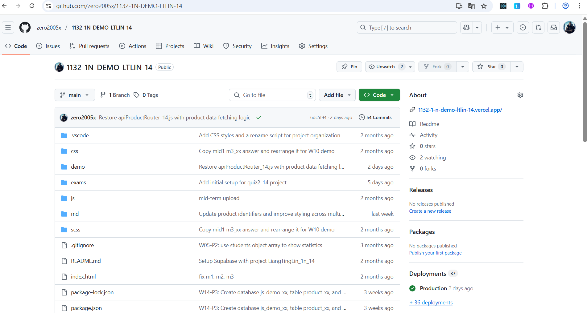
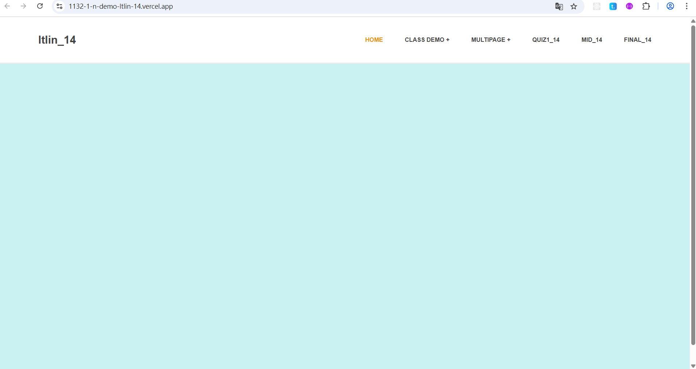
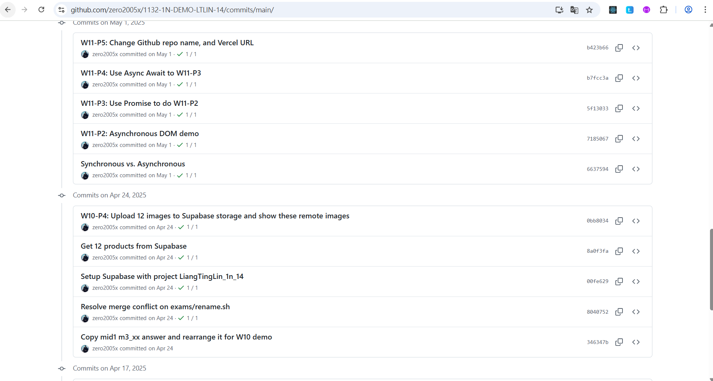
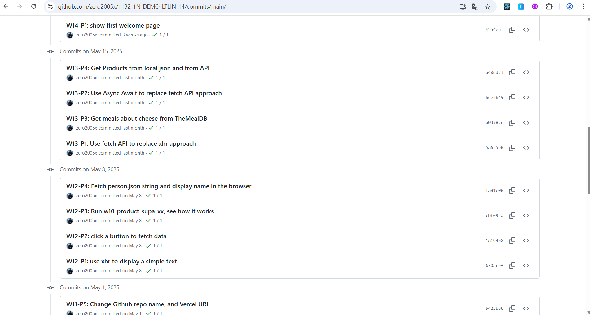
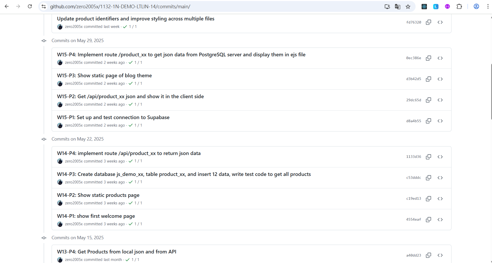
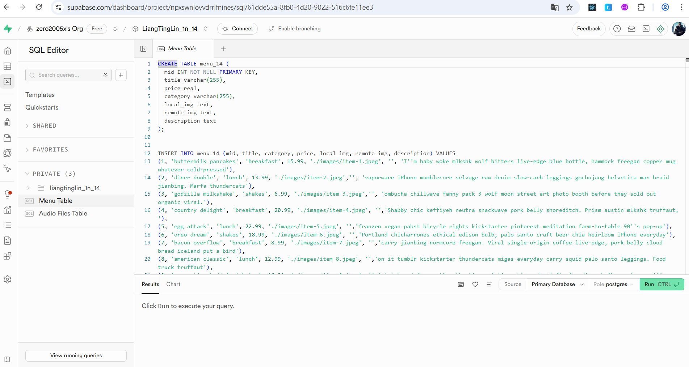
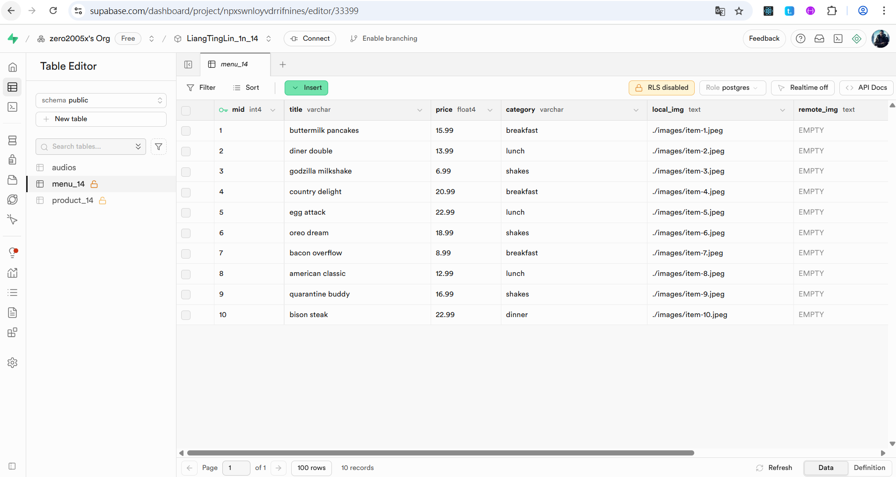
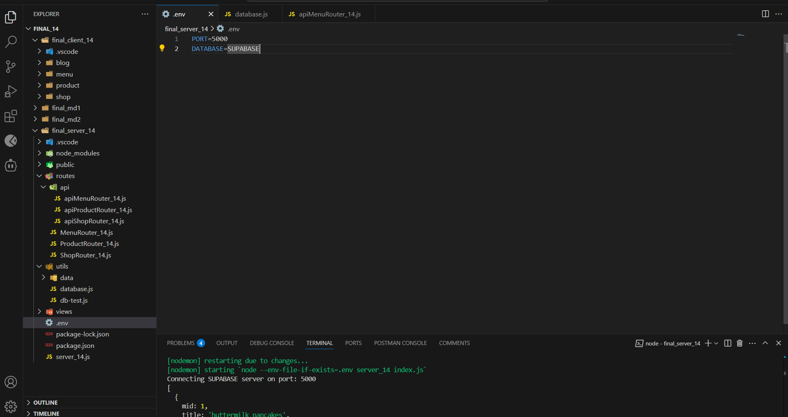
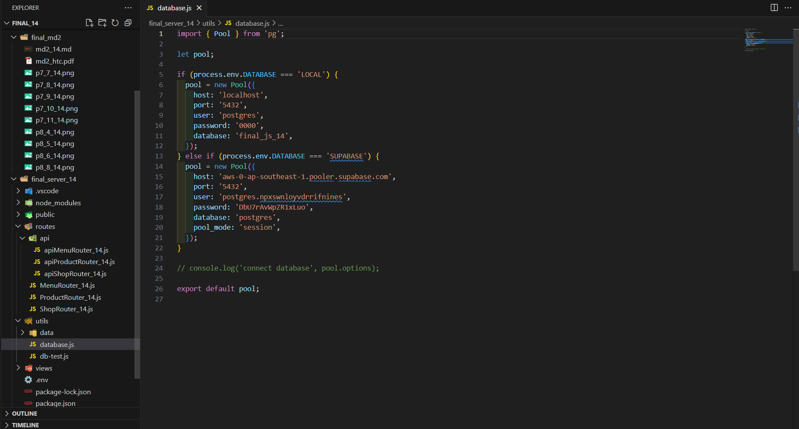
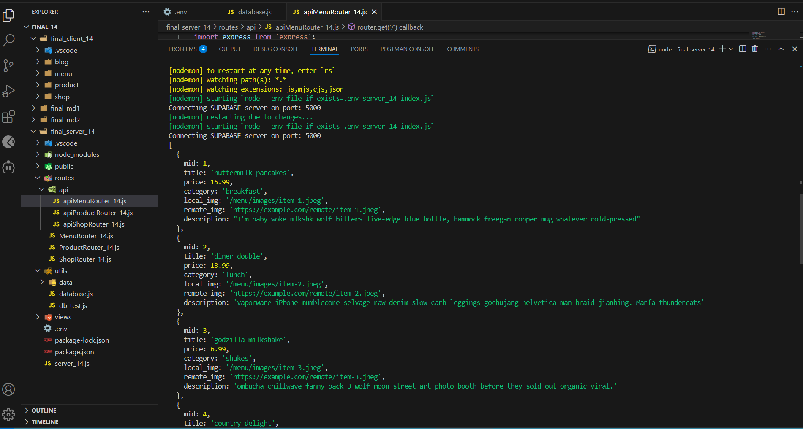

# (25%) 113-2 JavaScript 期末考 1 -- 開放考試

##### 2025-06-12, at E201, from 21:00~21:40

#### Note:

1. 本期末考分兩部分，斷網考試及開放網路考試。
2. 請不要發揮同學愛，作弊雙方除了本次考試 0 分外，平常分數另扣 20 分，情節嚴重者會送校。
3. iClass 上請繳交 md2_14.pdf, final_md2.zip, final_server_14.zip，壓縮前請將 node_modules 刪除
4. 請直接將答案寫在 md2_14.md 上，老師出題及圖片放在 md2_htc.pdf 上，請依照老師所給的圖片來實作並標註
5. 跟小考相關的檔案及目錄名稱有 xx 時，必須要改成學號後 2 碼，沒有修改時，會視違犯情況扣分。
6. 每一張圖片要有機房左側背景，圖片上要有你的學號(或後兩碼)，圖片標註要跟老師所標註的類似。違者會依情節扣分。
7. 請自評分數，將每一題的 ? 填入分數，沒有填者，不會批改，以 0 分計算。

##### Your (Name, ID): (林亮廷, 913410014)

Part 2: 開放考試

- P7 (15%): 15 分
- P8 (10%): 10 分

##### 總分: 25 分

---

### (15%) P7: Github, Vercel, log commit

##### => 顯示 Github, Vercel 等相關資訊

[Github demoURL]()
[Vercel URL]()

##### => 顯示 W10~W15 所有 log 訊息

#### Your Answer

##### => 顯示 Github, Vercel 等相關資訊

[Your Github URL](https://github.com/zero2005x/1132-1N-DEMO-14)

[Your Vercel URL](https://1132-1N-DEMO-14.vercel.app)

##### => 顯示 W10~W15 所有 log 訊息

---

### (10%) P8: 實作透過 Supabase 來取得 /api/menu_14

##### => Supabase SQL 顯示及執行

##### => Supabase table 顯示 4 筆資料

##### => .env, database.js 設定, server console 顯示

#### Your Answer

##### => Supabase SQL 顯示及執行

##### => Supabase table 顯示 4 筆資料

##### => .env, database.js 設定, server console 顯示

