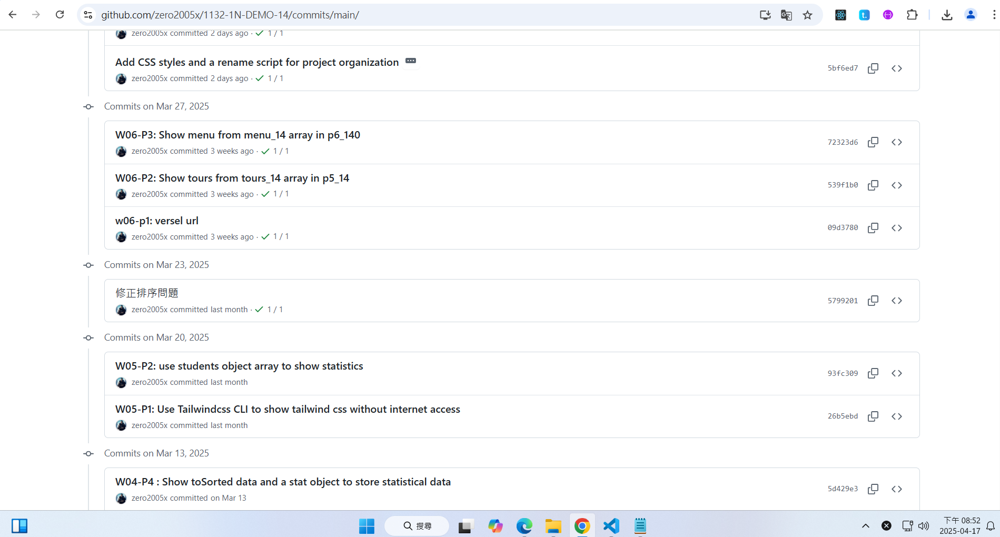

# (40%) 113-2 JavaScript 網頁設計一 期中 mid2 -- 開放網路

##### 2025-04-17, at E201, from 20:50~22:00

#### Note:

1. mid1 是斷網考試，mid2 是開放網路考試，如果 mid1 題目已經完成 (P1, P2, P3)，可以開始做 mid2 題目不須網路的部分 (P4)
2. 請不要發揮同學愛，作弊雙方除了本次考試 0 分外，平常分數另扣 20 分，情節嚴重者會送校。
3. iClass 上請繳交 md_mid2_14.pdf, md_mid2.zip(md 壓縮檔), mid1_14.zip (code 壓縮檔)，壓縮前請將 node_modules 全部砍掉
4. 請直接將答案寫在 md_mid2_14/md_mid2_14.md 上，老師出題及圖片放在 md_mid2_htc.pdf 上，請依照老師所給的圖片來實作並標註
5. 跟期中考相關的檔案及目錄名稱有 xx 時，必須要改成學號後 2 碼，沒有修改時，會視違犯情況扣分。
6. 每一張圖片要有機房左側背景，圖片上要有你的學號(或後兩碼)，圖片標註要跟老師所標註的類似。違者會依情節扣分。
7. 請自評分數，將每一題的 ? 填入分數，沒有填者，不會批改，以 0 分計算。

##### Your (Name, ID): (林亮廷, 913410014)

Mid2: 40% 開放網路

- P4 (10%): 10 分
- P5 (20%): 20 分
- P6 (10%): 10 分

##### 總分: 40 分

---

## Mid2: 40%

### (10%) P4: 將 m1_14, m2_14, m3_14 放入選單中，可以在 local 端正確執行

請使用老師提供的 mid2_14.zip 來實作此題
將 mid1 斷網考試的 code 放入 exams/mid1_14 下

需要修改 index.html, classdemo_14.js
點選 m1_14 時，要呼叫 showMid('m1_14')，其餘類同。

##### => 檔案結構

##### => local 端，Chrome 顯示 m1_14

##### => local 端，Chrome 顯示 m2_14

##### => local 端，Chrome 顯示 m3_14

#### Your Answer

##### => local 端，Chrome 顯示 m1_14

##### => local 端，Chrome 顯示 m2_14

##### => local 端，Chrome 顯示 m3_14

##### => index.html & classdemo_14.js code 重點，兩個檔互相對照

---

### (20%) P5: 將本次期中考試的答案放入你的 Github demo 中，並佈署到 Vercel，讓 midterm 與 quiz1 可以在 Vercel 端正確執行

##### => 檔案結構

期中考試 m1_14, m2_14, m3_14 請放入 exams/mid1_14 目錄下
quiz1 考試 p1_14, p2_14, p3_14 請放入 exams/quiz1_14 下

quiz1 可以用你已經完成的檔案，如果用老師的檔案，回答本次的考試時，需要改 xx 為你的學號後兩碼。

請將 md_mid1_14, md_mid2_14 md 目錄下所有檔案，複製到 exams/mid1_14，之後就在這裡寫 md_mid2_14.md 答案

本題要能將 mid1 或 quiz1 考試的題目，在 Vercel 上執行。

##### => Github & Vercel URL

[Github demoURL]()
[Vercel URL]()

##### => Vercel 端，Chrome 顯示 m1_14 (mid1)

##### => Vercel 端，Chrome 顯示 m2_14 (mid1)

##### => Vercel 端，Chrome 顯示 m3_14 (mid1)

##### => Vercel 端，Chrome 顯示 p1_14 (quiz1)

##### => Vercel 端，Chrome 顯示 p3_14 (quiz1)

#### Your Answer

##### => 檔案結構

請將 md_mid1_14, md_mid2_14 目錄下所有檔案，複製到 exams/mid1_14，之後就在這裡寫 md_mid2_14.md 答案

##### => Github & Vercel URL

[Github demoURL]()
[Vercel URL]()

##### => Vercel 端，Chrome 顯示 m1_14 (mid1)

##### => Vercel 端，Chrome 顯示 m2_14 (mid1)

##### => Vercel 端，Chrome 顯示 m3_14 (mid1)

##### => Vercel 端，Chrome 顯示 p1_14 (quiz1)

##### => Vercel 端，Chrome 顯示 p3_14 (quiz1)

---

### (10%) P6: 顯示 W1~W6 所有 log 訊息

##### => 顯示 W6~W1 每一週的 log，一週一張圖片，要有 6 張，如果沒有做好，有做的週還是可以剪貼圖片上來，可能有部分分數

#### Your Answer

##### => 顯示 W6~W1 每一週的 log，一週一張圖片，要有 6 張，如果沒有做好，有做的週還是可以剪貼圖片上來，可能有部分分數

---
