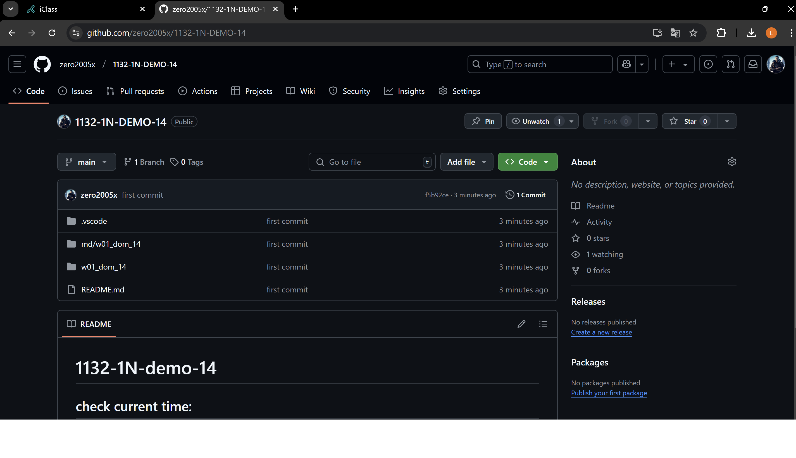
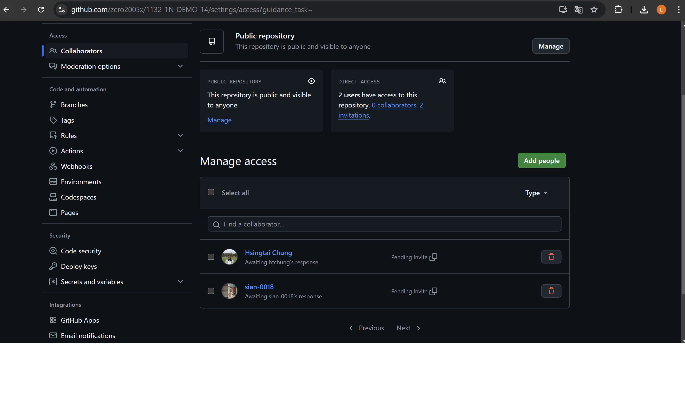
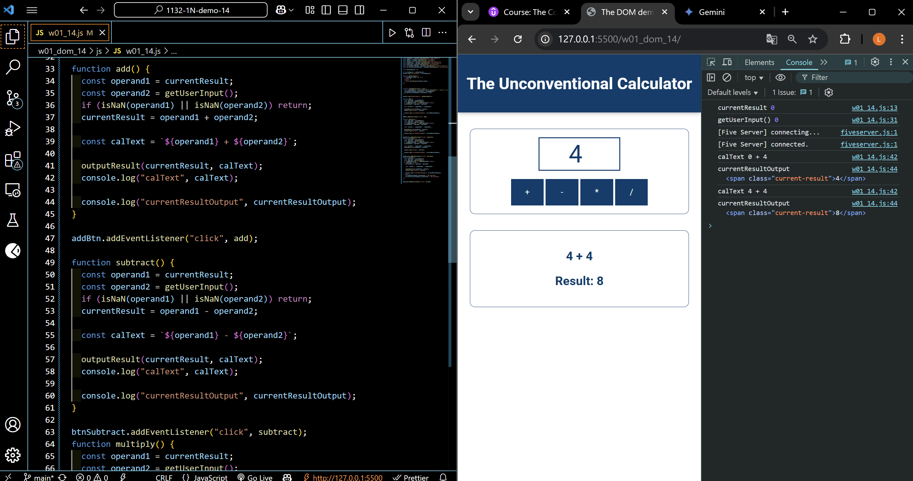
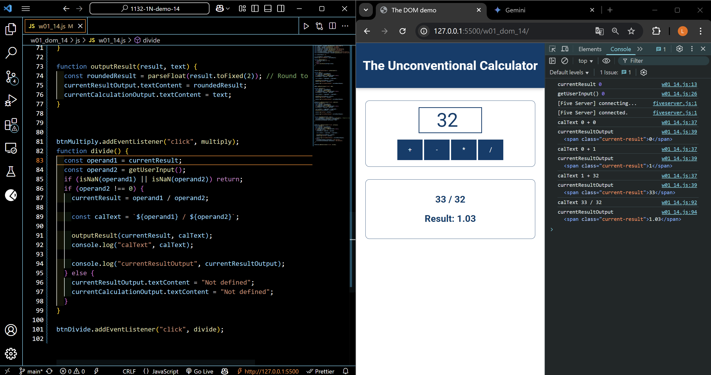
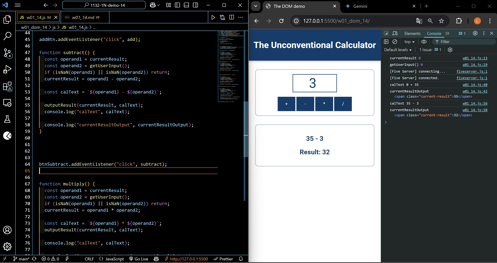
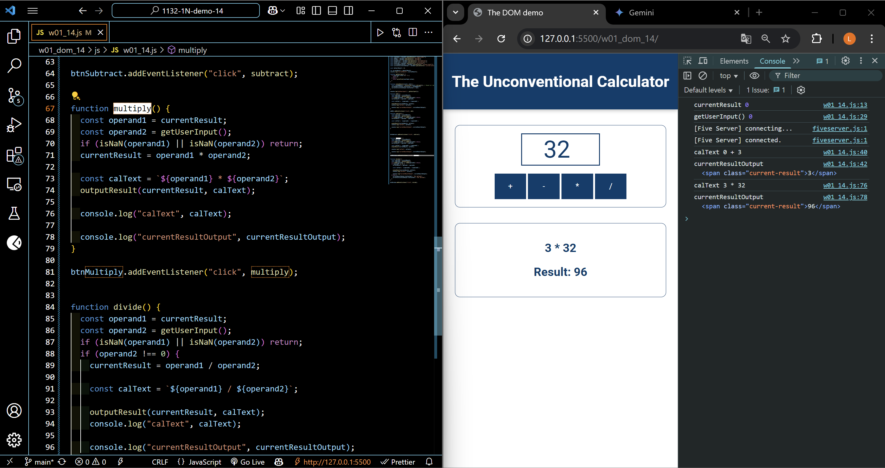

[Your Github URL](https://github.com/zero2005x/1132-1N-DEMO-14)

[Your Vercel URL](https://1132-1N-DEMO-14.vercel.app)

###  W01-P1: Create a Github repo for 1132 semester
 
=> Github repo.



```
f5b92ce%09zero2005x%09Thu Feb 20 18:56:14 2025 +0800    first commit
```

=> To share to course professor and TA.
 


```
5ba9e12%09zero2005x%09Thu Feb 20 19:05:51 2025 +0800    add Github Add collaborator
```

### W01-P2: implement add button
 



```
5ba9e12%09zero2005x%09Thu Feb 20 19:05:51 2025 +0800    add Github Add collaborator
```

### W01-P3: implement divide button
 


```

```

### W01-P4: implement subtract button
 


```

```

### W01-P5: implement multiply button
 


```

```

### W01 git logs for W15


```
a1080ed%09zero2005x%09Fri Feb 21 23:12:57 2025 +0800    add stbtract, multiply function, fix Float point precision
```