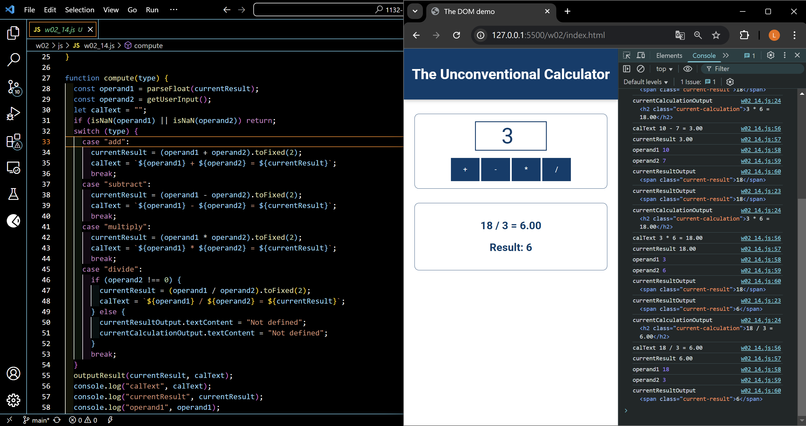
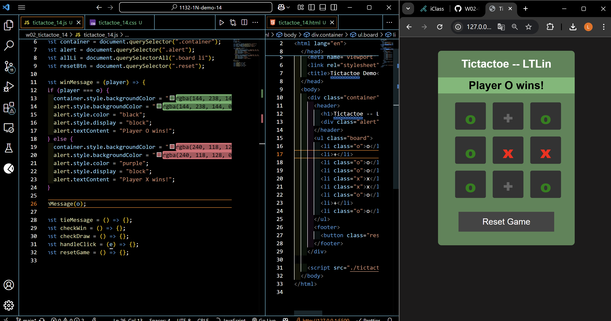
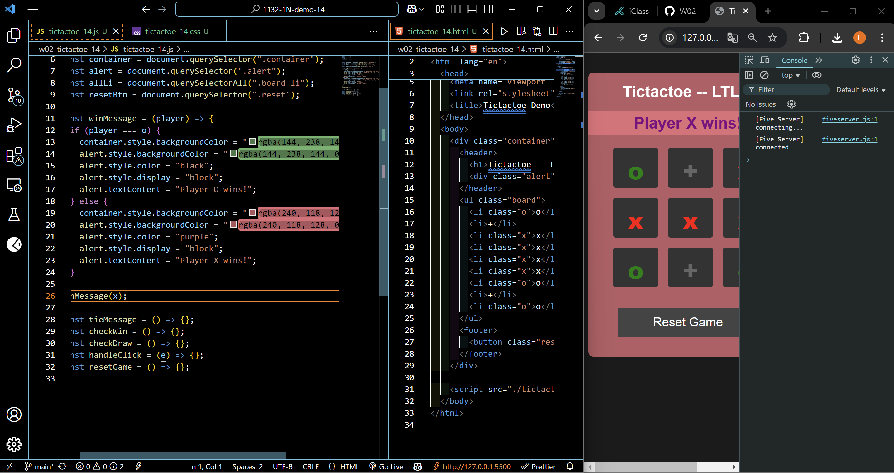
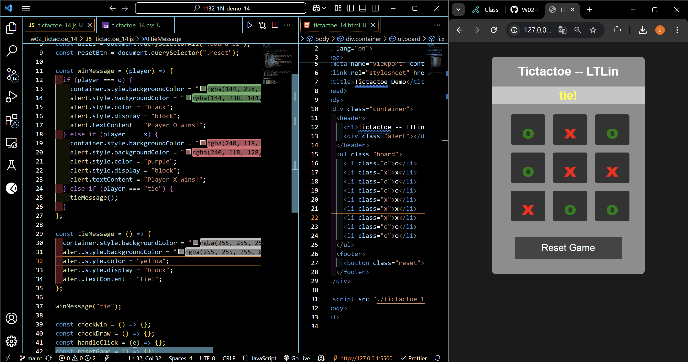

[Your Github URL](https://github.com/zero2005x/1132-1N-DEMO-14)

[Your Vercel URL](https://1132-1N-DEMO-14.vercel.app)

### W02-P1: refine the code in week 1 using only one compute function

=>



=>


```
0357360%09zero2005x%09Thu Feb 27 19:11:47 2025 +0800    W02-P1: refine the code in week 1 using only one compute function
```

## W02-P2: show winning message and tie message

#### ==> play o wins



#### ==> play x wins



#### ==> tie



```

```
