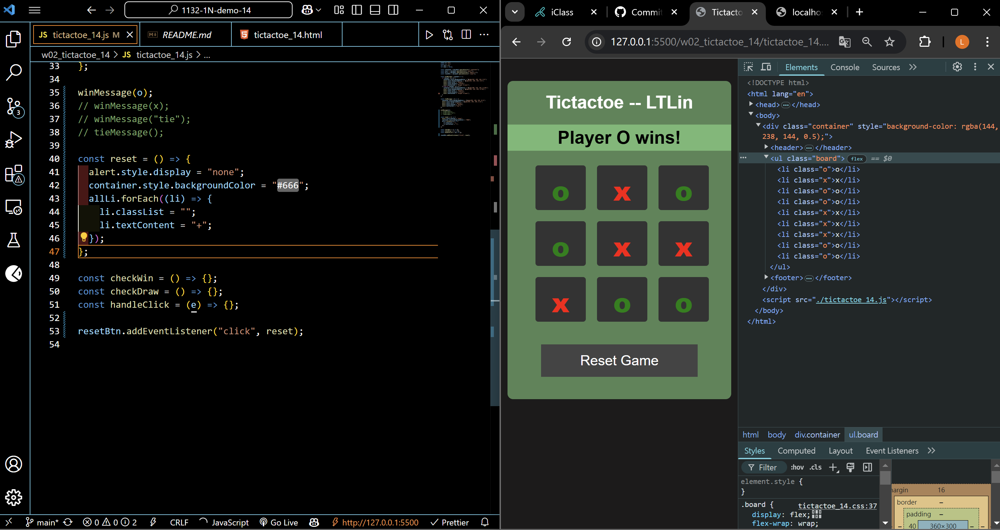
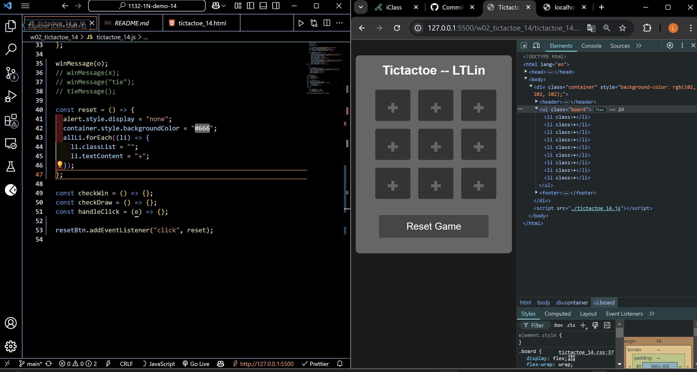
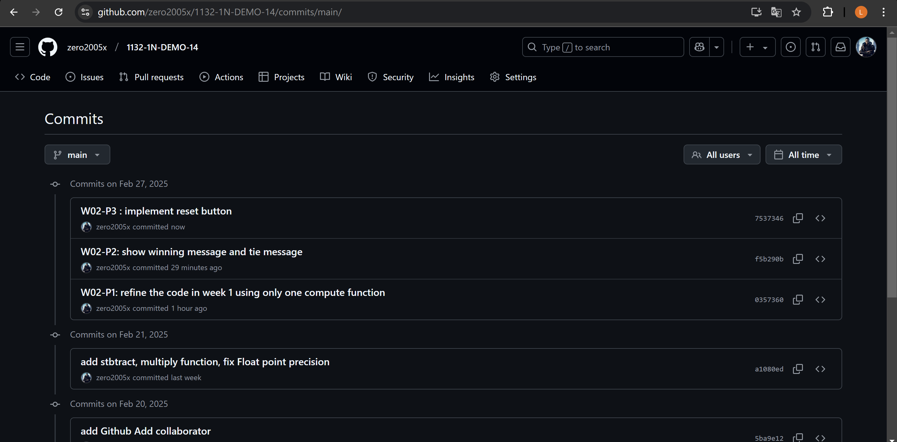

[Your Github URL](https://github.com/zero2005x/1132-1N-DEMO-14)

[Your Vercel URL](https://1132-1N-DEMO-14.vercel.app)

### W02-P1: refine the code in week 1 using only one compute function

=>


=>


```
0357360%09zero2005x%09Thu Feb 27 19:11:47 2025 +0800    W02-P1: refine the code in week 1 using only one compute function
```

## W02-P2: show winning message and tie message

#### ==> play o wins


#### ==> play x wins


#### ==> tie


```
f5b290b%09zero2005x%09Thu Feb 27 20:29:22 2025 +0800    W02-P2: show winning message and tie message
```

### W02-P3 : implement reset button

#### ==> initially player o win



#### ==> after reset button is pressed



```
7537346%09zero2005x%09Thu Feb 27 20:57:51 2025 +0800     W02-P3 : implement reset button
```

### W02-log: git logs for W02


