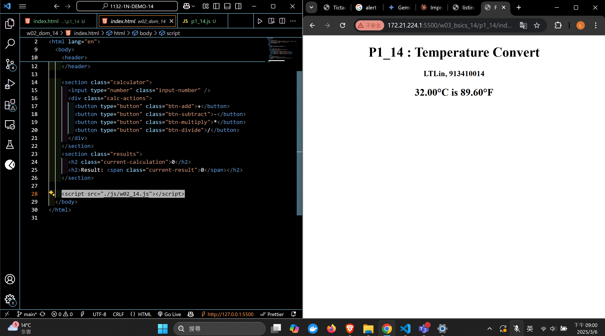

[Your Github URL](https://github.com/zero2005x/1132-1N-DEMO-14)

[Your Vercel URL](https://1132-1N-DEMO-14.vercel.app)

### W03-P1: Implement checkWin(player) using three different cases

#### => player o wins


#### => player x wins


#### => no player wins


```
1fa2af5%09zero2005x%09Thu Mar 6 19:15:58 2025 +0800     W03-P1: Implement checkWin(player) using three different cases
```

## W03-P2: play TicTacToe successfully

#### => player o wins


#### => player x wins


#### => tie


```
a4f790e%09zero2005x%09Thu Mar 6 20:13:18 2025 +0800     W03-P2: play TicTacToe successfully
```

### W03-P3 : Temperature Convert from c to f




```
62082e4%09zero2005x%09Thu Mar 6 21:02:47 2025 +0800     W03-P3 : Temperature Convert from c to f
```

### W03-log: git logs for W03


```

```
