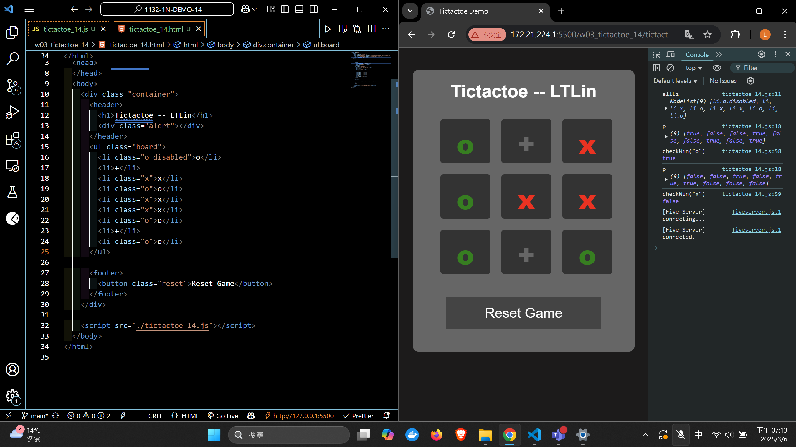
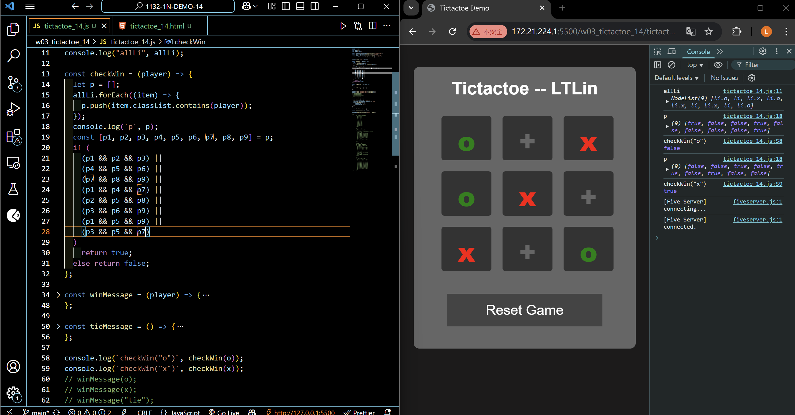
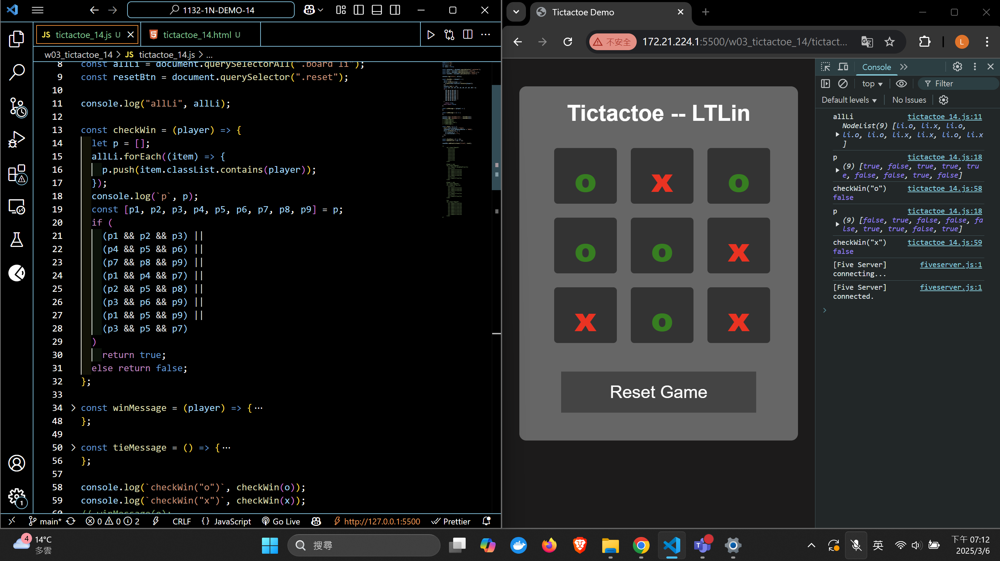
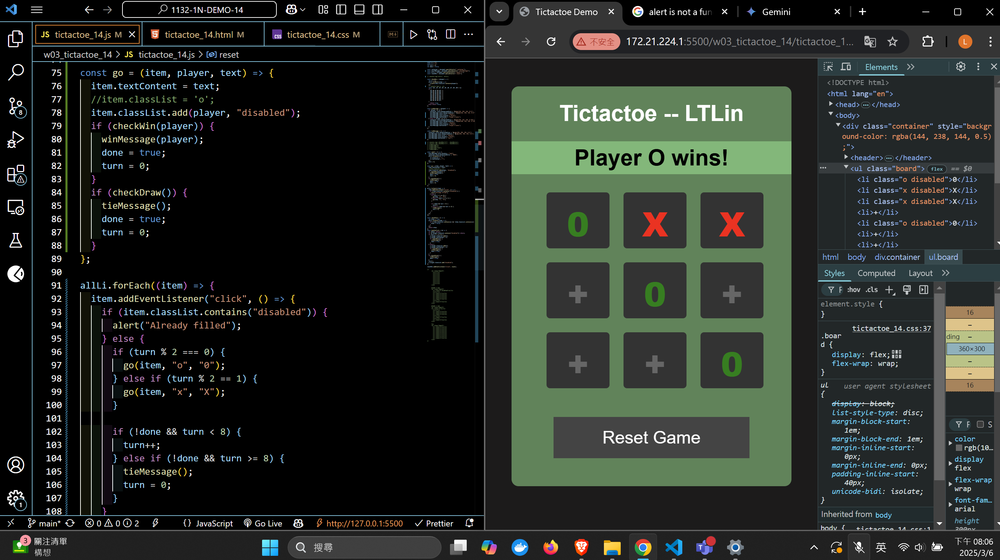
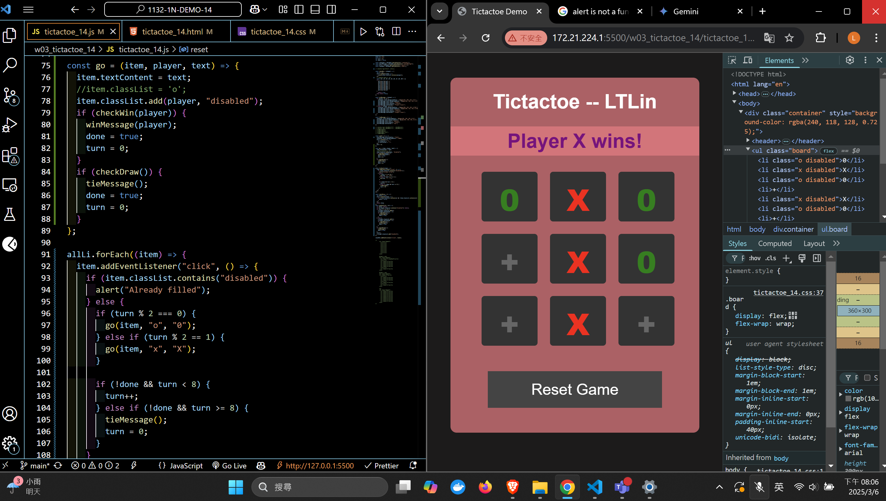
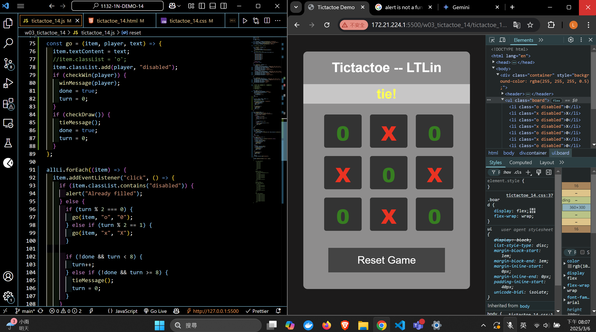
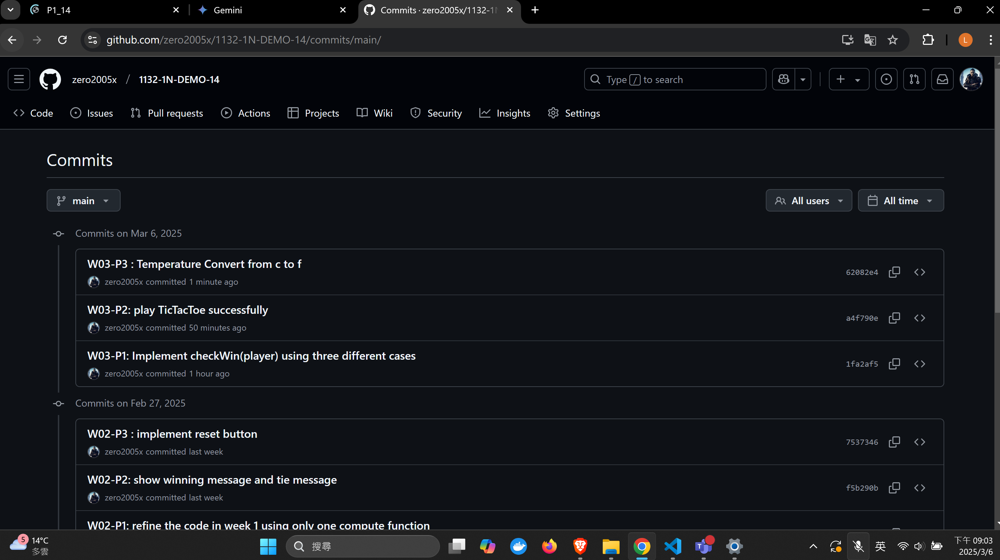

[Your Github URL](https://github.com/zero2005x/1132-1N-DEMO-14)

[Your Vercel URL](https://1132-1N-DEMO-14.vercel.app)

### W03-P1: Implement checkWin(player) using three different cases

#### => player o wins



#### => player x wins



#### => no player wins



```
1fa2af5%09zero2005x%09Thu Mar 6 19:15:58 2025 +0800     W03-P1: Implement checkWin(player) using three different cases
```

## W03-P2: play TicTacToe successfully

#### => player o wins



#### => player x wins



#### => tie



```

```

### W02-P3 : implement reset button

#### ==> initially player o win


#### ==> after reset button is pressed


```

```

### W02-log: git logs for W02


