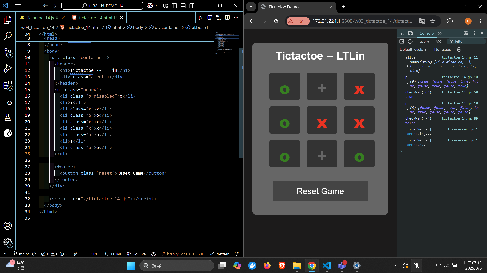
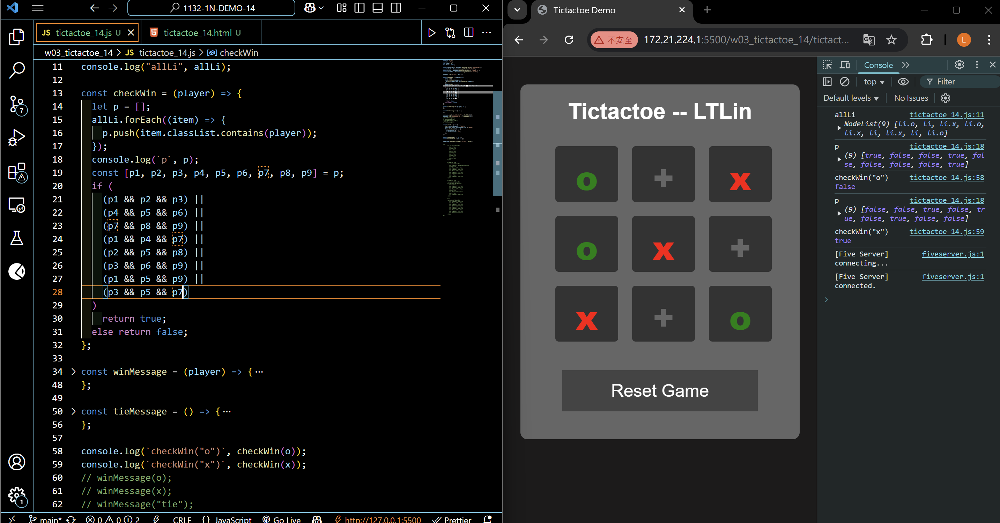
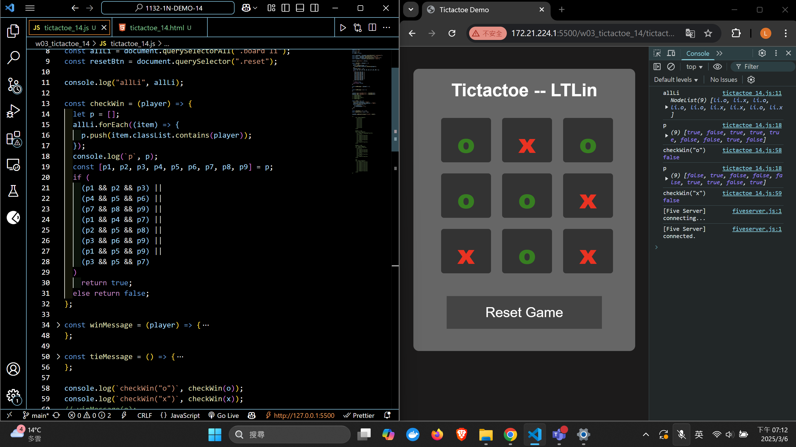

[Your Github URL](https://github.com/zero2005x/1132-1N-DEMO-14)

[Your Vercel URL](https://1132-1N-DEMO-14.vercel.app)

### W03-P1: Implement checkWin(player) using three different cases

#### => player o wins



#### => player x wins



#### => no player wins



```

```

## W02-P2: show winning message and tie message

#### ==> play o wins


#### ==> play x wins


#### ==> tie


```

```

### W02-P3 : implement reset button

#### ==> initially player o win


#### ==> after reset button is pressed


```

```

### W02-log: git logs for W02


