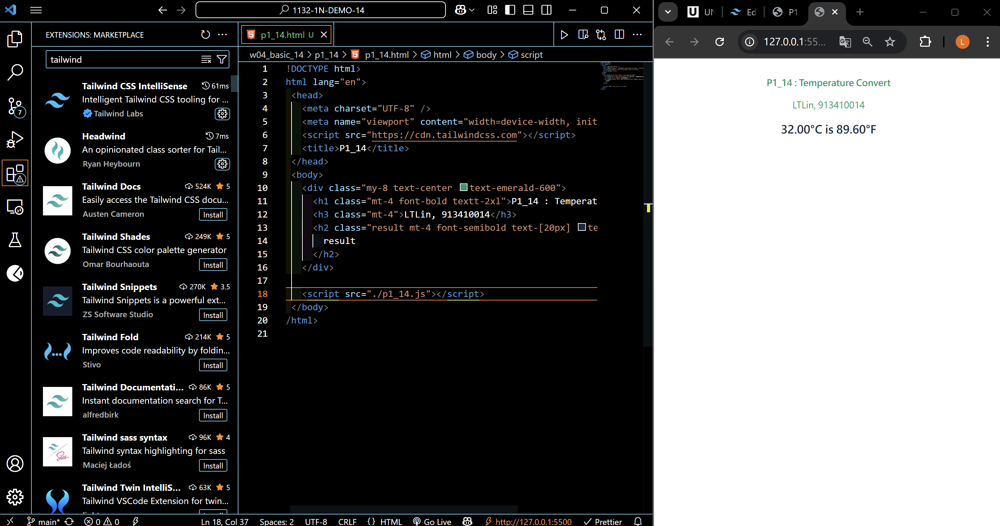

[Your Github URL](https://github.com/zero2005x/1132-1N-DEMO-14)

[Your Vercel URL](https://1132-1N-DEMO-14.vercel.app)

### W04-P1: Setup Tailwindcss for p1_14.html



```
cb130c1%09zero2005x%09Thu Mar 13 18:52:45 2025 +0800    W04-P1: Setup Tailwindcss for p1_14.html
```

## W04-P2: create html code to show sdata original in js code


```

```

### W04-P3 :

#### ==>


#### ==>


```

```

### W04-log: git logs for W04


