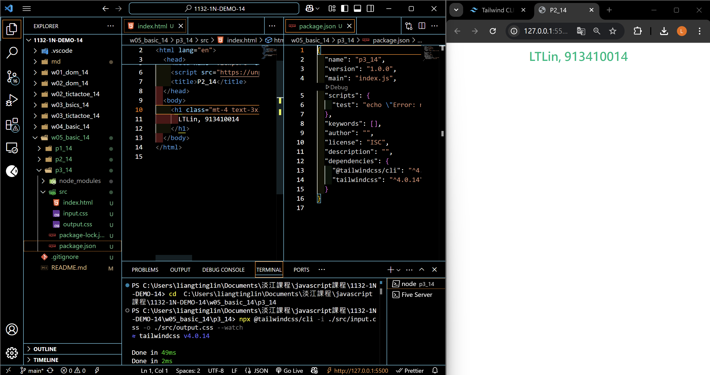
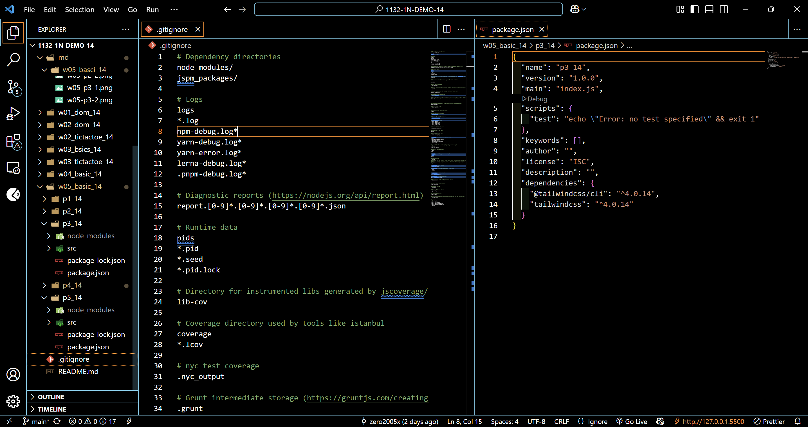
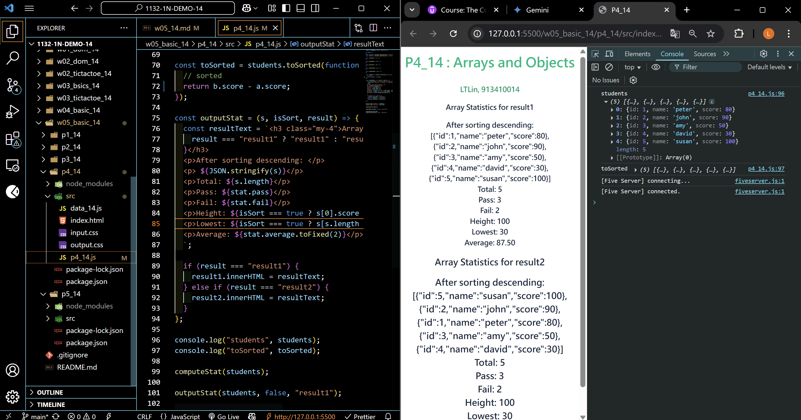
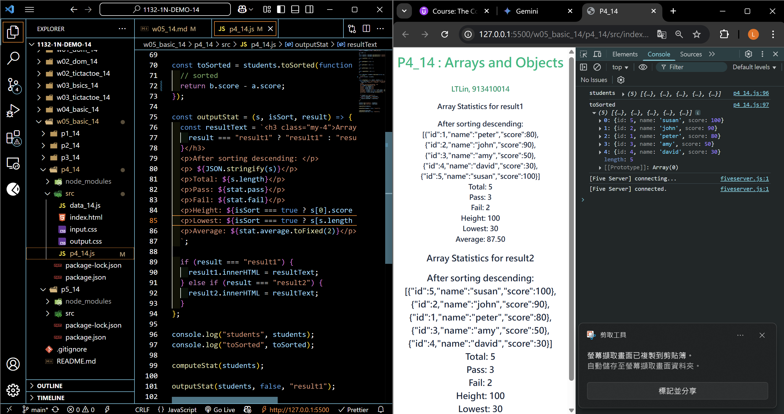
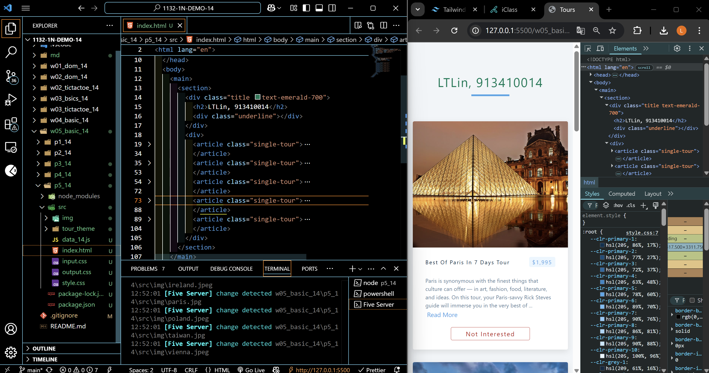
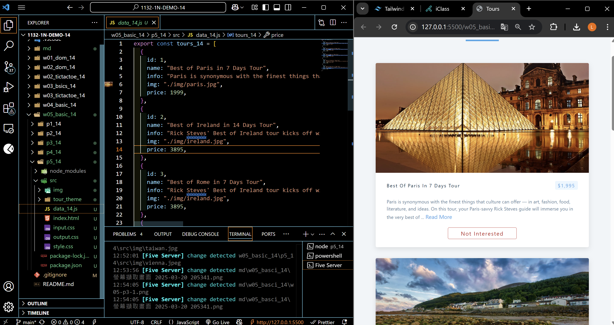
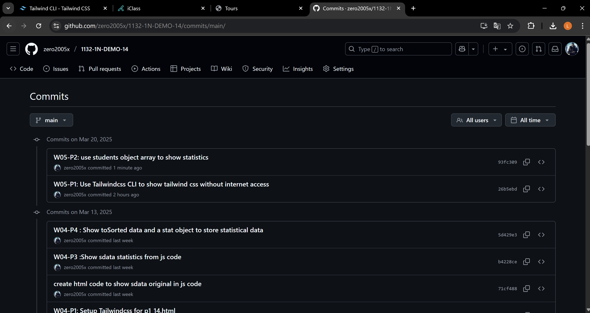

[Your Github URL](https://github.com/zero2005x/1132-1N-DEMO-14)

[Your Vercel URL](https://1132-1N-DEMO-14.vercel.app)

### W05-P1: Use Tailwindcss CLI to show tailwind css without internet access





```
26b5ebd%09zero2005x%09Thu Mar 20 18:44:43 2025 +0800    W05-P1: Use Tailwindcss CLI to show tailwind css without internet access
```

### W05-P2: use students object array to show statistics

#### => no sorting, show in result1 section



#### => after sorting, show in result2 section



```
26b5ebd%09zero2005x%09Thu Mar 20 18:44:43 2025 +0800    W05-P1: Use Tailwindcss CLI to show tailwind css without internet access
```

### W05-P3: show 5 tours in p5_14.html using tour theme

#### => display 5 tours in tour theme, make tailwind css works as well



#### => use array tour_14 to store all data of 5 tours



```

```

### W05-log: git logs for W05



```

```
