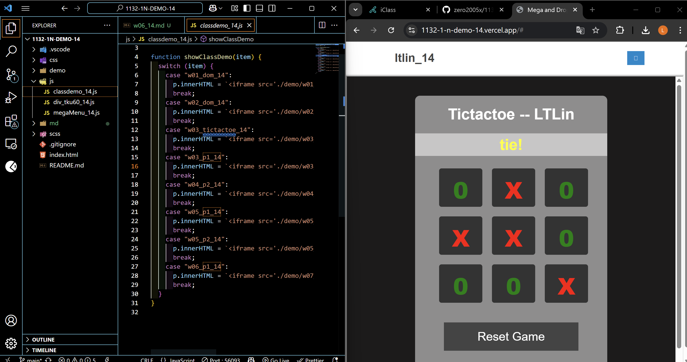
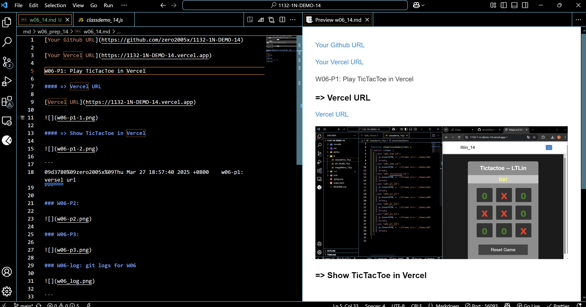
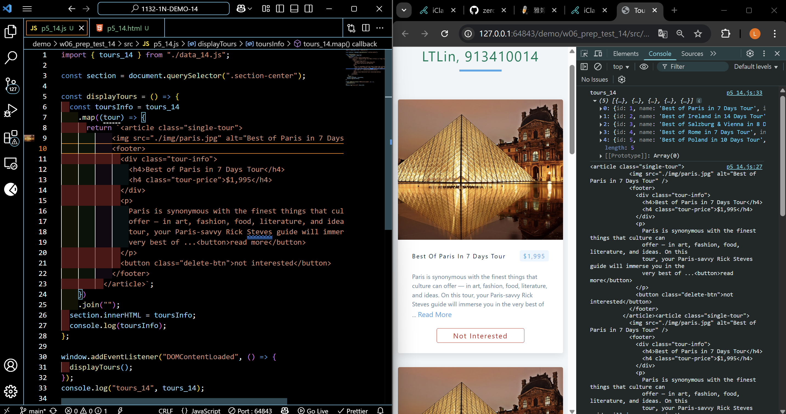
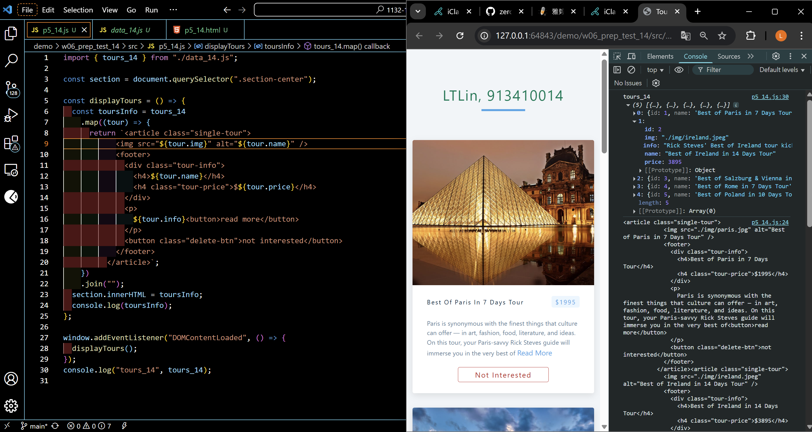
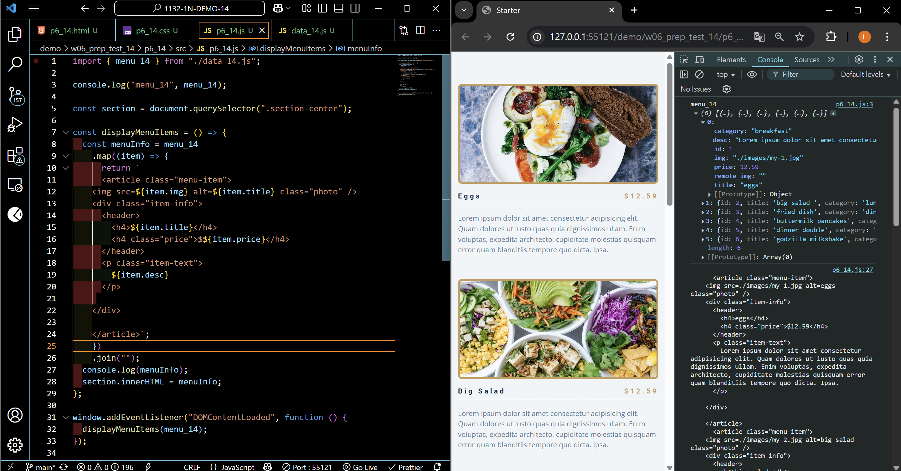

[Your Github URL](https://github.com/zero2005x/1132-1N-DEMO-14)

[Your Vercel URL](https://1132-1N-DEMO-14.vercel.app)

W06-P1: Play TicTacToe in Vercel

#### => Vercel URL

[Vercel URL](https://1132-1N-DEMO-14.vercel.app)



#### => Show TicTacToe in Vercel



```
09d3780%09zero2005x%09Thu Mar 27 18:57:40 2025 +0800    w06-p1: versel url
```

### W06-P2: Show tours from tours_14 array in p5_14

#### => all tours are the same



#### => each tour is different based on the info in tours_14 array



```
539f1b0%09zero2005x%09Thu Mar 27 20:07:05 2025 +0800     W06-P2: Show tours from tours_14 array in p5_14
```

### W06-P3: Show menu from menu_14 array in p6_14



### W06-log: git logs for W06


```

```
