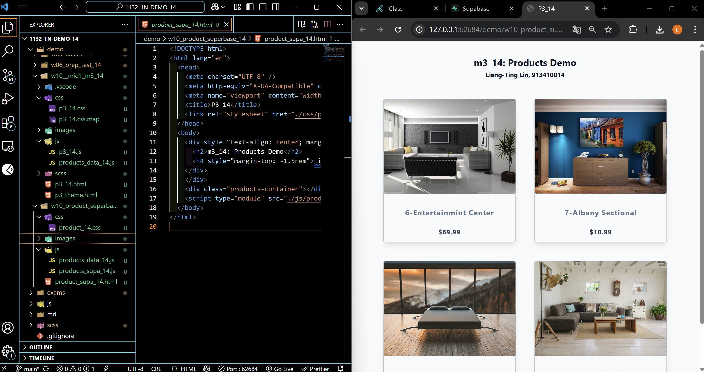

[Your Github URL](https://github.com/zero2005x/1132-1N-DEMO-14)

[Your Vercel URL](https://1132-1N-DEMO-14.vercel.app)

W10-P1:

#### =>W10-P1: Copy mid1 m3_xx answer and rearrange it for W10 demo



```
346347b%09zero2005x%09Thu Apr 24 18:42:17 2025 +0800     Copy mid1 m3_xx answer and rearrange it for W10 demo
```

### W10-P2: Setup Supabase with project LiangTingLin_1n_14

#### => show product_14 table with 3 data


#### => show SQL to create product_14 table and insert three data


#### => show Project URL and ANON KEY for this project


```

```

### W10-P3:


### W10-log: git logs for W10


```

```
