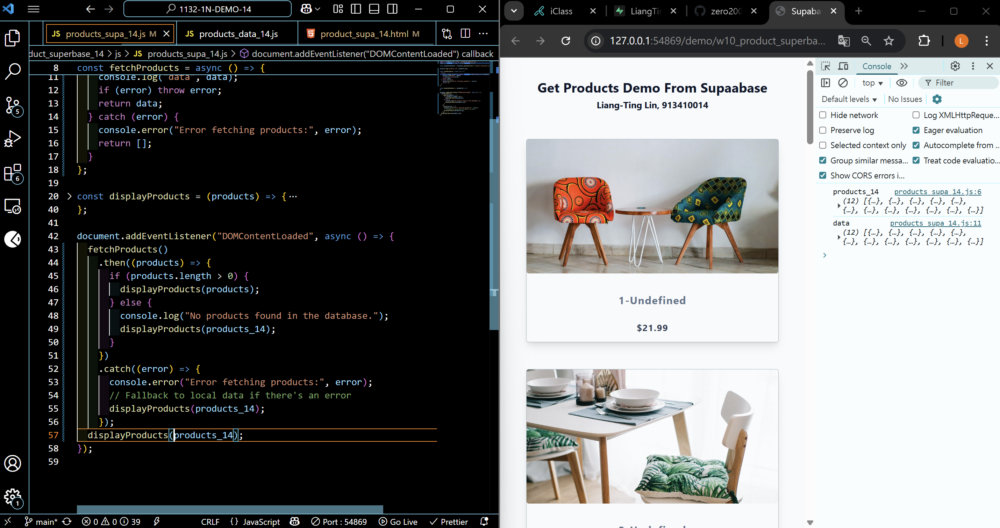
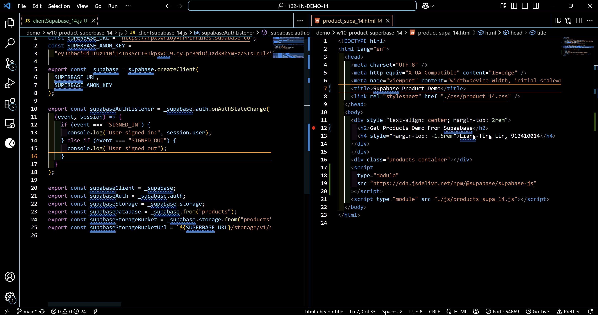
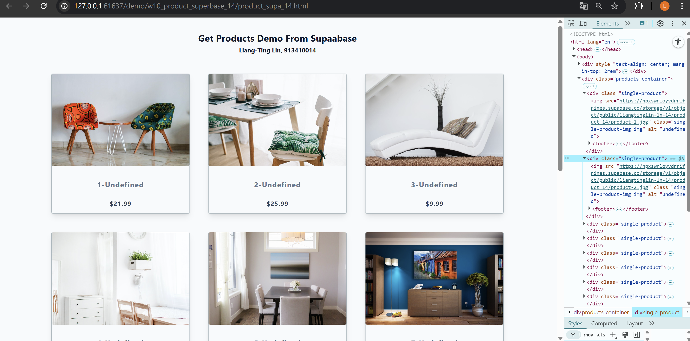
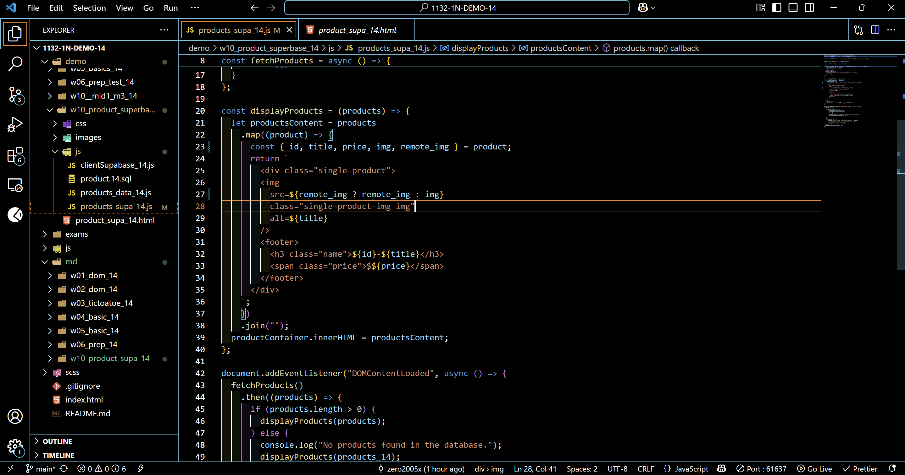
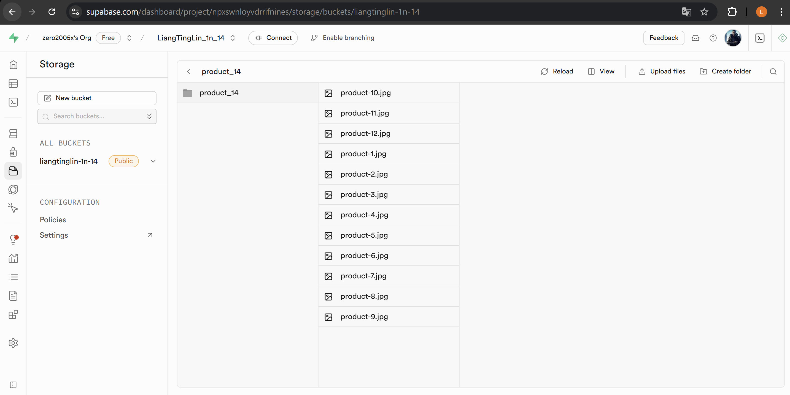

[Your Github URL](https://github.com/zero2005x/1132-1N-DEMO-14)

[Your Vercel URL](https://1132-1N-DEMO-14.vercel.app)

W10-P1:

#### =>W10-P1: Copy mid1 m3_xx answer and rearrange it for W10 demo


```
346347b%09zero2005x%09Thu Apr 24 18:42:17 2025 +0800     Copy mid1 m3_xx answer and rearrange it for W10 demo
```

### W10-P2: Setup Supabase with project LiangTingLin_1n_14

#### => show product_14 table with 3 data


#### => show SQL to create product_14 table and insert three data


#### => show Project URL and ANON KEY for this project


```
00fe629%09zero2005x%09Thu Apr 24 19:27:01 2025 +0800    Setup Supabase with project LiangTingLin_1n_14
```

### W10-P3: Get 12 products from Supabase

#### => show how to fetch products from Supabase



#### => Show how to get supabase-js to create supabase client



### W10-P4: Upload 12 images to Supabase storage and show these remote images

#### => show the first two images are from Supabase storage



#### => show remote_img in product_xx table



#### => show the js code to use remote_img instead of img



```
0bb8034%09zero2005x%09Thu Apr 24 20:45:09 2025 +0800    W10-P4: Upload 12 images to Supabase storage and show these remote images
```

### W10-log: git logs for W10


```

```
