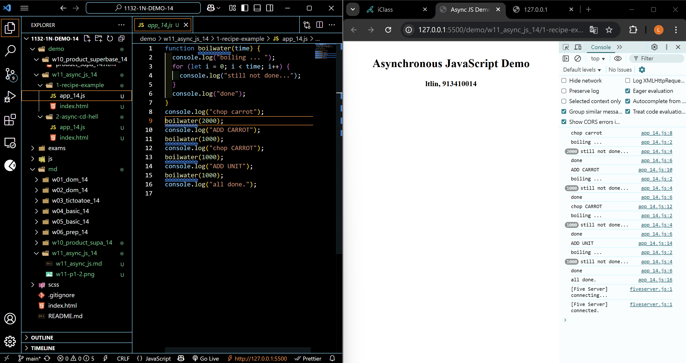
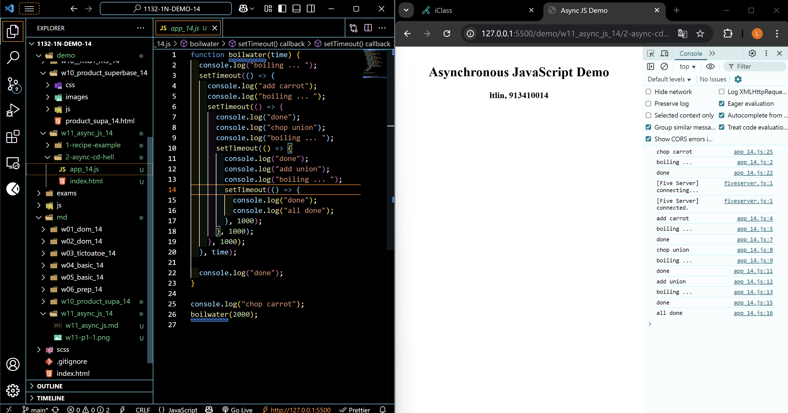
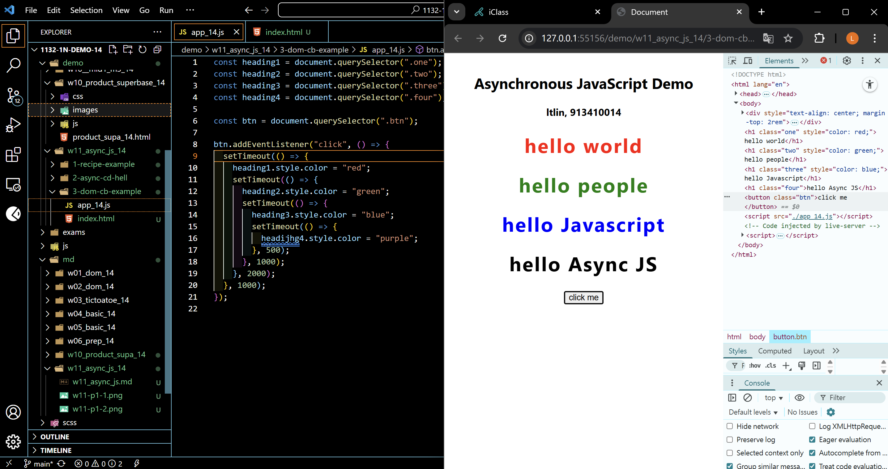
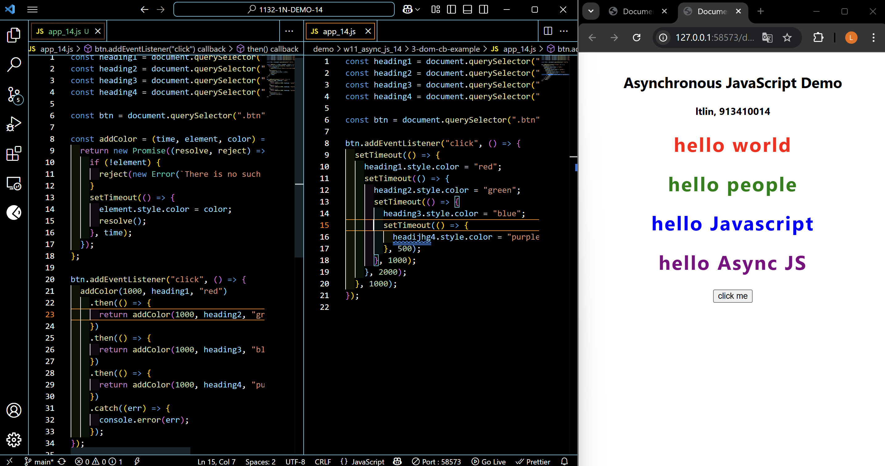
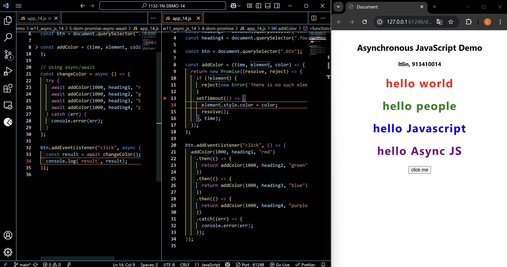
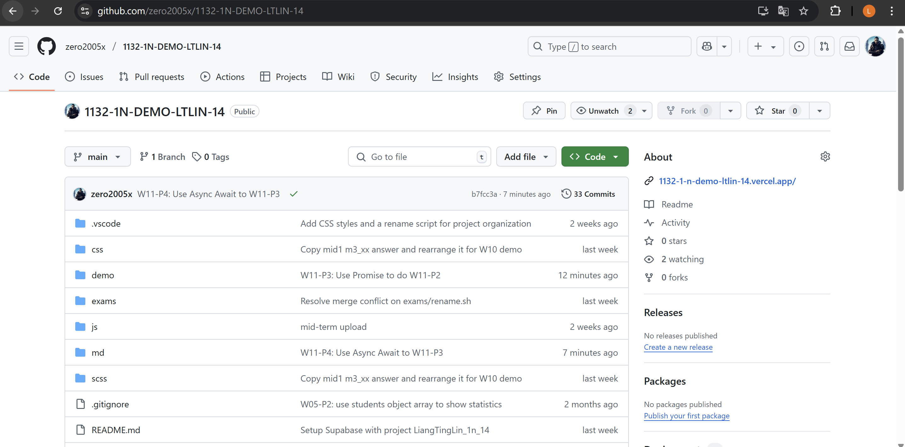
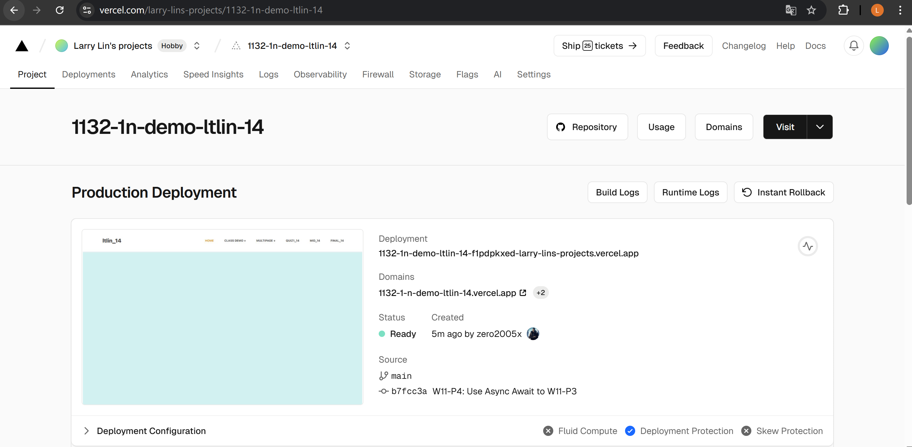
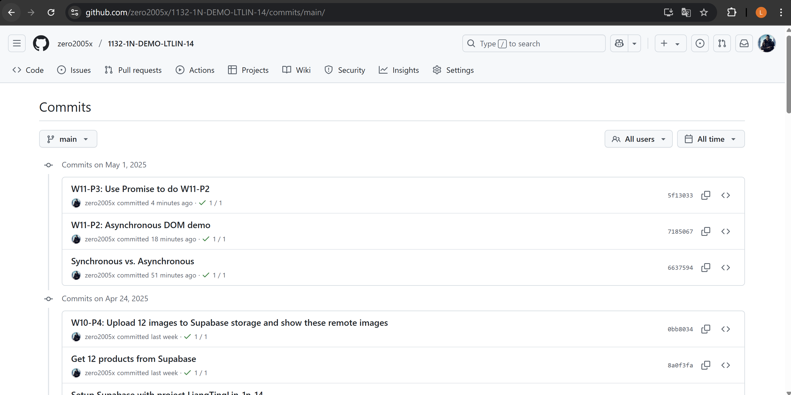

### W11-P1: Synchronous vs. Asynchronous

#### => Synchronous demo



#### => Asynchronous demo



```
6637594%09zero2005x%09Thu May 1 19:53:02 2025 +0800     Synchronous vs. Asynchronous
```

### W11-P2: Asynchronous DOM demo



```
7185067%09zero2005x%09Thu May 1 20:26:22 2025 +0800     W11-P2: Asynchronous DOM demo
```

### W11-P3: Use Promise to do W11-P2



```
5f13033%09zero2005x%09Thu May 1 20:40:34 2025 +0800      W11-P3: Use Promise to do
```

### W11-P4: Use Async Await to W11-P3



```
b7fcc3a%09zero2005x%09Thu May 1 20:45:30 2025 +0800     W11-P4: Use Async Await to W11-P3
```

### W11-P5: Change Github repo name, and Vercel URL

#### => Github



#### => Vercel



```
b423b66%09zero2005x%09Thu May 1 20:54:01 2025 +0800     W11-P5: Change Github repo name, and Vercel URL
```

### W11-log: git logs for W11



```

```
