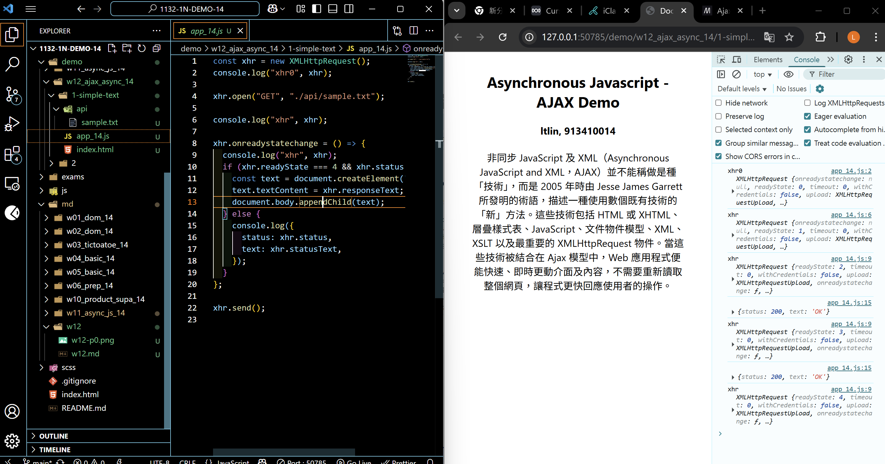
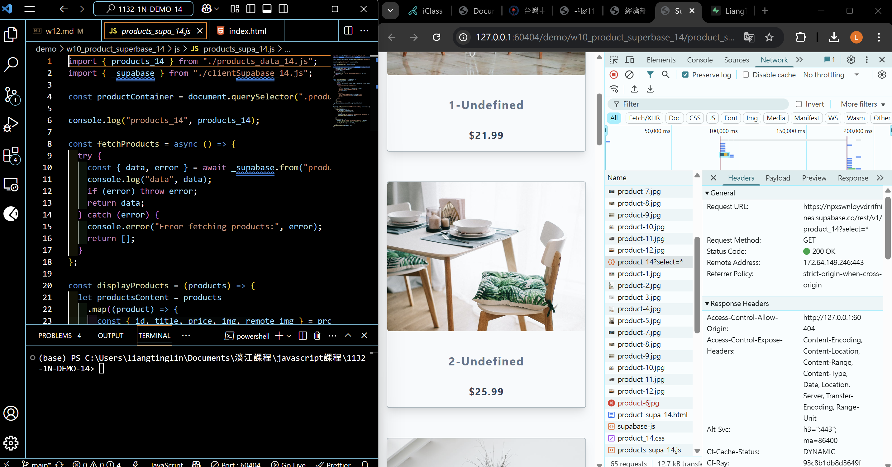
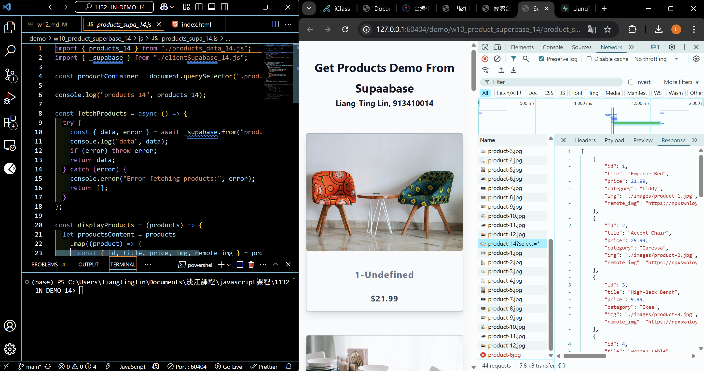
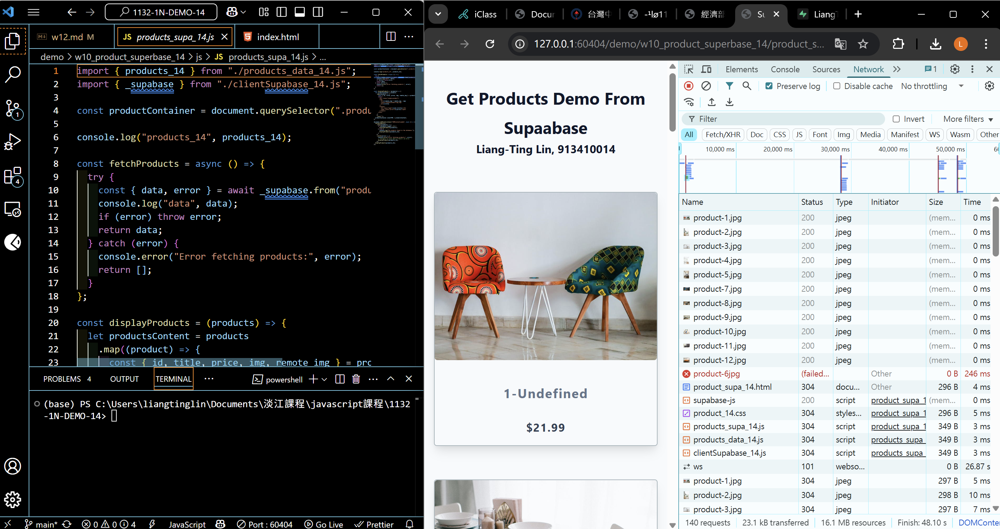

[Your Github URL](https://github.com/zero2005x/1132-1N-DEMO-14)

[Your Vercel URL](https://1132-1N-DEMO-14.vercel.app)

## W12-P1: use xhr to display a simple text



```
30ac9f%09zero2005x%09Thu May 8 19:14:36 2025 +0800     W12-P1: use xhr to display a simple text
```

## W12-P2: click a button to fetch data


```
1a194b8%09zero2005x%09Thu May 8 19:27:21 2025 +0800     W12-P2: click a button to fetch data
```

## W12-P3: Run w10_product_supa_xx, see how it works

#### => \_supabase.from('product_xx').select('\*');



#### => check response



#### => check how many http requests being done in fetchProducts



```

```
