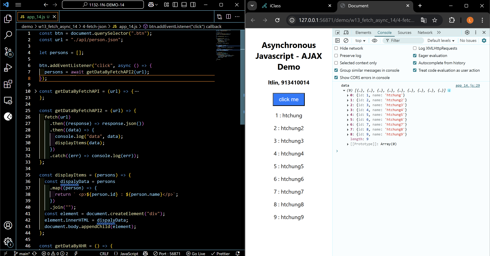
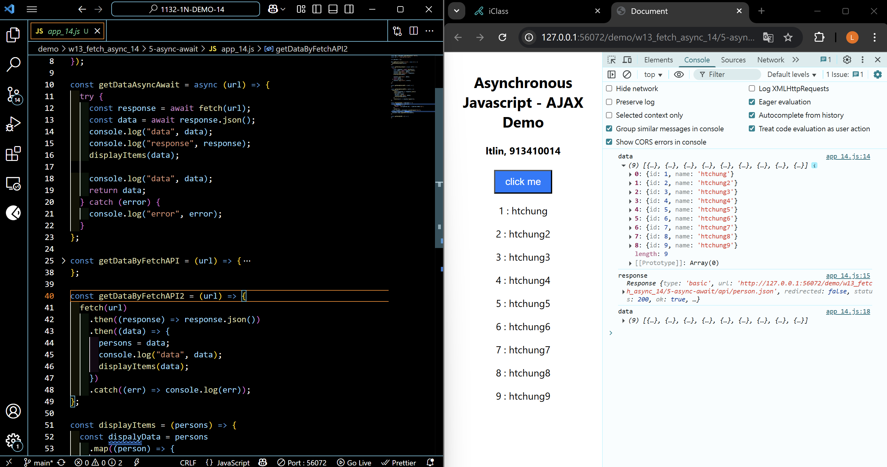
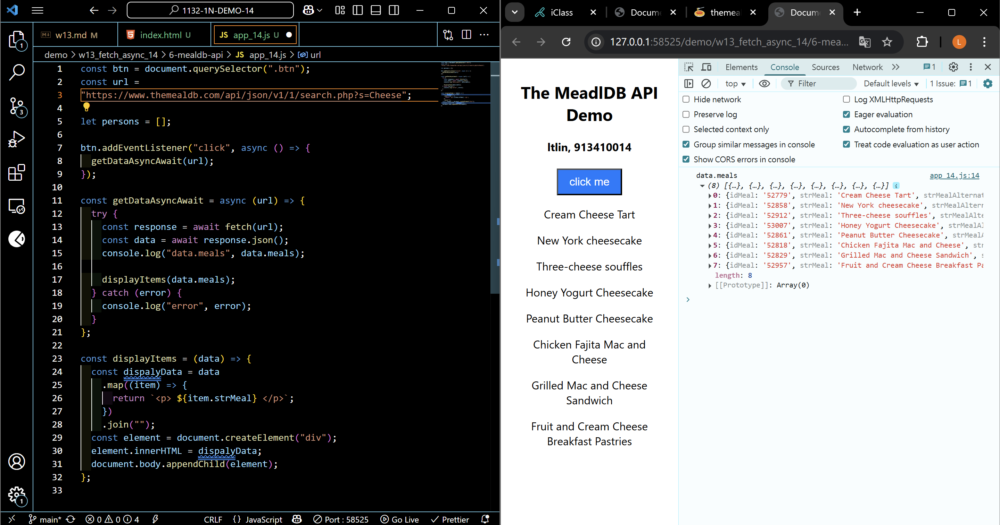
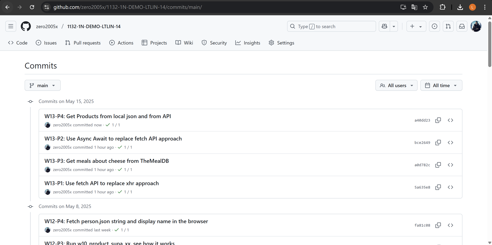

[Your Github URL](https://github.com/zero2005x/1132-1N-DEMO-14)

[Your Vercel URL](https://1132-1N-DEMO-14.vercel.app)

## W13-P1: Use fetch API to replace xhr approach

#### =>



```
5a635e8%09zero2005x%09Thu May 15 19:43:37 2025 +0800    W13-P1: Use fetch API to replace xhr approach
```

## W13-P2: Use Async Await to replace fetch API approach



```


```

## W13-P3: Get meals about cheese from TheMealDB



```
a0d782c%09zero2005x%09Thu May 15 20:02:42 2025 +0800    W13-P3: Get meals about cheese from TheMealDB
```

### W13-log: git logs for W12



```

```

```

```
