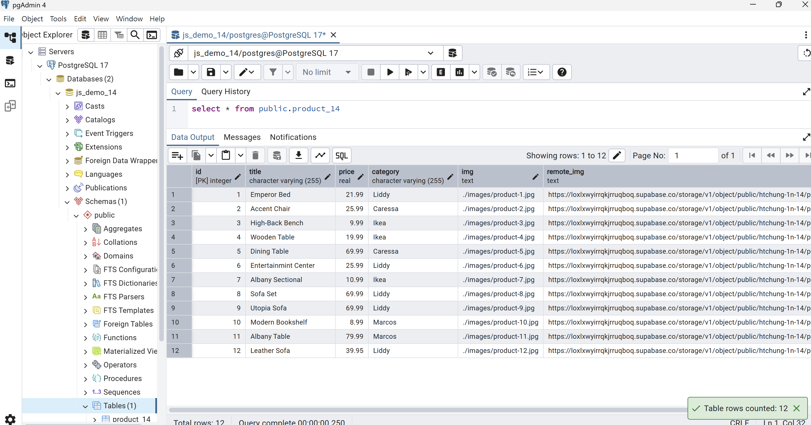
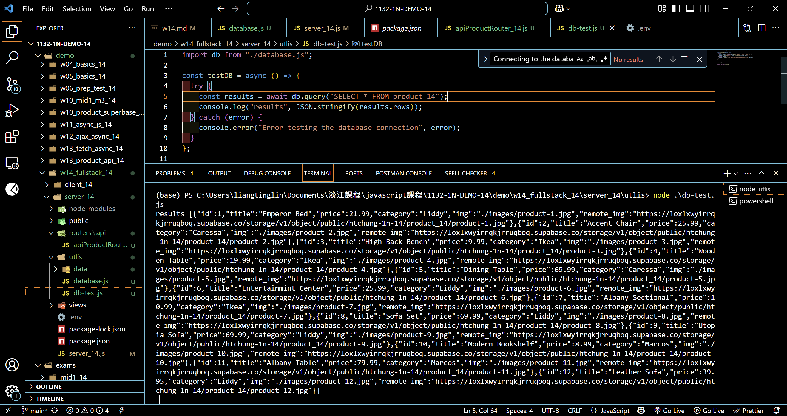
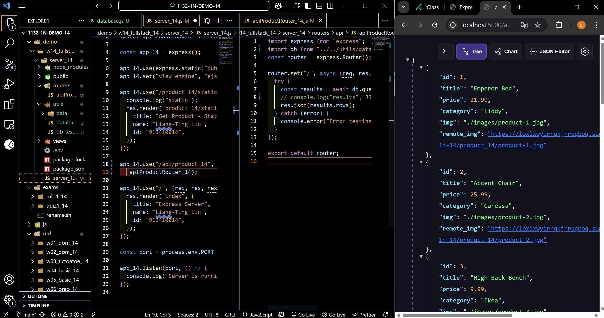
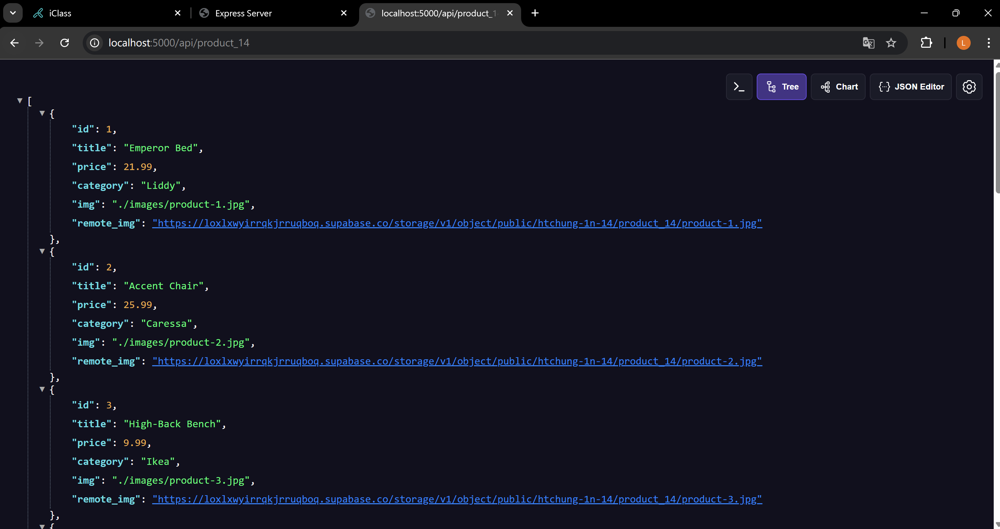
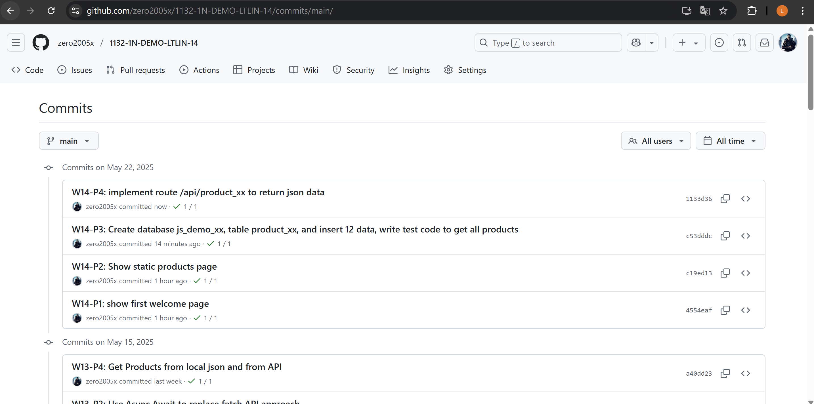

[Your Github URL](https://github.com/zero2005x/1132-1N-DEMO-14)

[Your Vercel URL](https://1132-1N-DEMO-14.vercel.app)

### W14-P1: show first welcome page

#### =>


```
4554eaf%09zero2005x%09Thu May 22 19:50:26 2025 +0800    W14-P1: show first welcome page
```

### W14-P2: Show static products page

#### => show render page with data passed into ejs page


#### => show how the product-1.jpg can be accessed fro public directory as root directory


```
c19ed13%09zero2005x%09Thu May 22 19:54:09 2025 +0800    W14-P2: Show static products page
```

### W14-P3: Create database js_demo_14, table product_14, and insert 12 data, write test code to get all products

#### => Create database js_demo_14, table product_14, and insert 12 data



#### => connect js_demo_14 database


#### => get all product data



```
c53dddc%09zero2005x%09Thu May 22 20:58:47 2025 +0800     W14-P3: Create database js_demo_14, table product_14, and insert 12 data, write test code to get all products
```

### W14-P4: implement route /api/product_14 to return json data



#### => whole json at /api/product_14



```
1133d36%09zero2005x%09Thu May 22 21:12:39 2025 +0800    W14-P4: implement route /api/product_14 to return json data
```

### W14-log: git logs for W14



```

```
