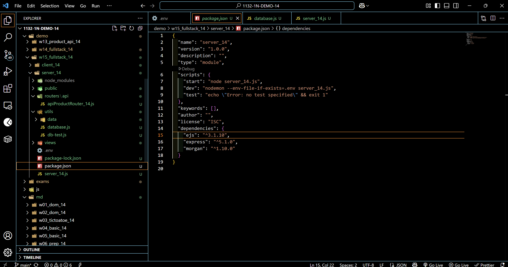
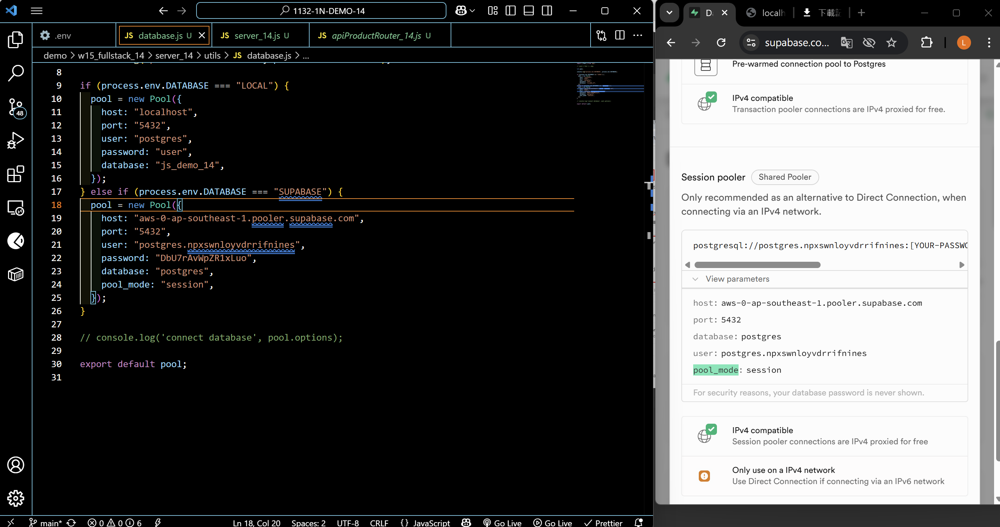
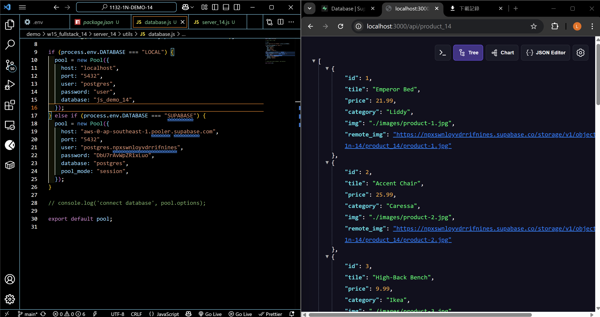
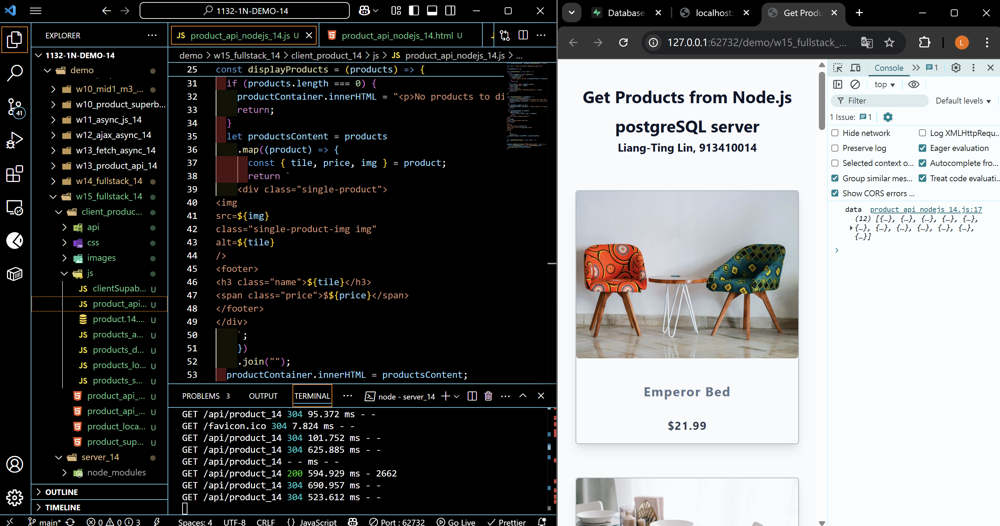
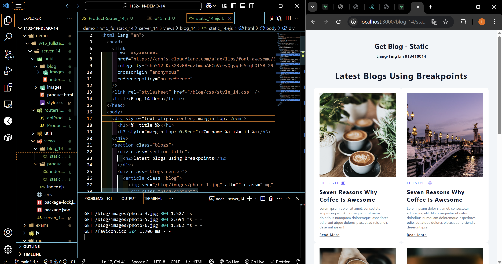
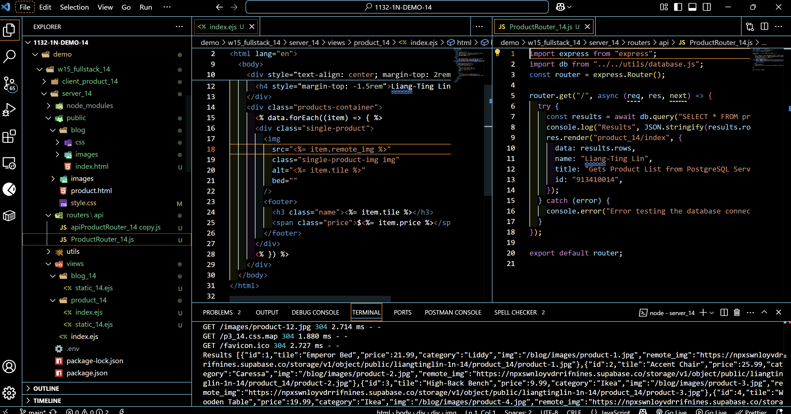
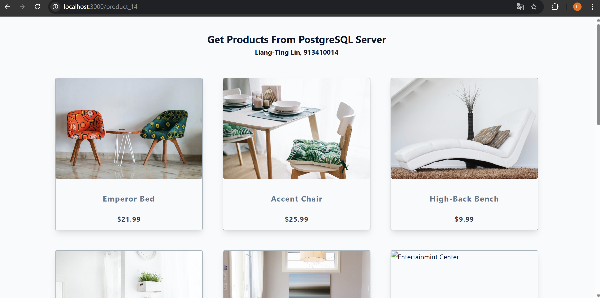

[Your Github URL](https://github.com/zero2005x/1132-1N-DEMO-14)

[Your Vercel URL](https://1132-1N-DEMO-14.vercel.app)

### W15-P1: Set up and test connection to Supabase

#### => add support for .env in package.json



#### => Connection setting to Supabase



#### => For route /api/product_14, get json from Supabase



```
d8a4b55%09zero2005x%09Thu May 29 19:22:08 2025 +0800    W15-P1: Set up and test connection to Supabase
```

### W15-P2: Get /api/product_14 json and show it in the client side

#### =>



```
29dc65d%09zero2005x%09Thu May 29 19:44:35 2025 +0800    W15-P2: Get /api/product_xx json and show it in the client side
```

### W15-P3: Show static page of blog theme



```
d3b42d5%09zero2005x%09Thu May 29 21:16:19 2025 +0800    W15-P3: Show static page of blog theme
```

### W15-P4: Implement route /product_xx to get json data from PostgreSQL server and display them in ejs file

#### => related code



#### => Chrome



```


```
